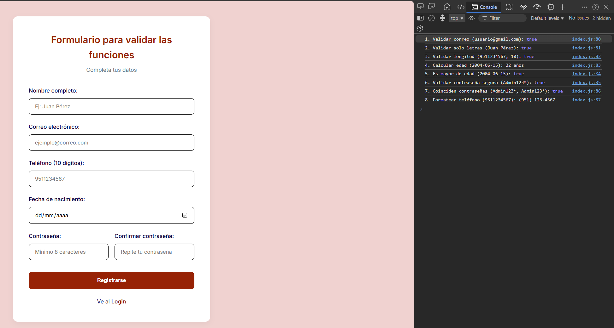
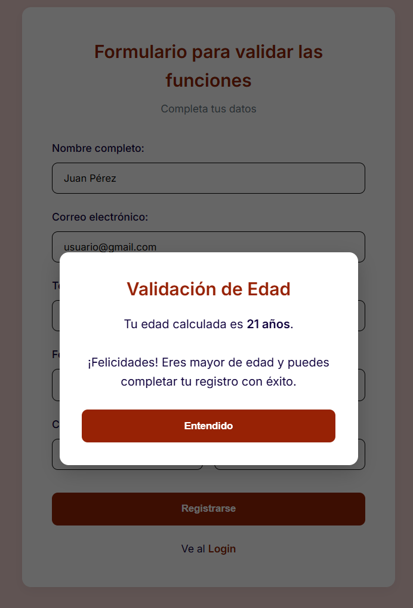

# Utileria JS - Validaciones y Formateo para Formularios

**Autor:** Leonardo Fuentes Lopez
**Institucion:** Instituto Tecnologico de Oaxaca
**No. de Control:** 22161062

## Que problema resuelve
Validar datos de entrada en formularios web suele ser repetitivo y propenso a errores. 
Utileria JS resuelve este problema proporcionando una libreria ligera, sin frameworks y facil de integrar que centraliza las validaciones mas comunes (correos, contraseñas seguras, calculo de edad) y el formateo de datos (como numeros telefonicos). 
Esto mejora la experiencia del usuario, automatiza las alertas y asegura que los datos lleguen estructurados correctamente al sistema.

## Instalacion
Solo debes incluir el archivo utileria.js en tu documento HTML, preferiblemente justo antes de cerrar la etiqueta </body> y siempre antes de cargar tu script principal.

```html
<script src="js/utileria.js"></script>

<script src="js/index.js"></script>
```
## Uso y Ejemplos de Codigo

A continuacion se muestran ejemplos practicos de como utilizar las funciones principales de la libreria.

### Validar correo electronico
Verifica que una cadena de texto cumpla con el formato estandar de un email.

```javascript
// 1. Valida formato de correo electrónico
function validarCorreo(correo) {
    // Verifica que tenga texto, una @, más texto, un punto y texto final
    let regex = /^[^\s@]+@[^\s@]+\.[^\s@]+$/;
    return regex.test(correo);
}   

```
### Validar solo letras
Comprueba que un texto contenga unicamente letras mayusculas, minusculas o espacios (acepta acentos y la letra ñ). Ideal para validar nombres completos.

```javascript
// 2. Solo letras mayúsculas/minúsculas, acepta vocales acentuadas
function soloLetras(texto) {
    let regex = /^[a-zA-ZáéíóúÁÉÍÓÚñÑ\s]+$/;
    return regex.test(texto);
}
```
### Validar longitud de un numero
Valida que un numero o cadena numerica tenga exactamente la longitud especificada.

```javascript
// 3. Validar longitud de un número 
function validarLongitud(numero, maxLongitud) {
    let textoNumero = numero.toString();
    return textoNumero.length === maxLongitud;
}
```
### Calcular edad y verificar mayoria de edad
`calcularEdad` devuelve la edad exacta en anos enteros a partir de una fecha (YYYY-MM-DD), mientras que `esMayorDeEdad` devuelve un booleano confirmando si tiene 18 anos o mas.

```javascript
// 4. Calcula edad a partir de fecha de nacimiento
function calcularEdad(fechaNacimiento) {
    let fechaNac = new Date(fechaNacimiento);
    let fechaActual = new Date();    
    let edad = fechaActual.getFullYear() - fechaNac.getFullYear();
    let mes = fechaActual.getMonth() - fechaNac.getMonth();    
    // Si el mes actual es menor al mes de nacimiento, o si es el mismo mes pero el día de hoy es menor
    if (mes < 0 || (mes === 0 && fechaActual.getDate() < fechaNac.getDate())) {
        edad--; 
    }
    return edad;
}
// 5. Validar si es mayor de edad
function esMayorDeEdad(fechaNacimiento) {
    let edad = calcularEdad(fechaNacimiento);
    return edad >= 18;
}
```

### Validar contraseña

Comprueba que la contraseña tenga al menos 8 caracteres, una mayuscula, una minuscula, un numero y un caracter especial.

```javascript
// 6. Validar contraseña segura (mayúscula, minúscula, número, carácter especial y min 8 caracteres)
function validarPassword(password) {
    let tieneMayuscula = /[A-Z]/.test(password);
    let tieneMinuscula = /[a-z]/.test(password);
    let tieneNumero = /[0-9]/.test(password);
    let tieneEspecial = /[!@#$%^&*(),.?":{}|<>]/.test(password);
    let longitudValida = password.length >= 8;

    return tieneMayuscula && tieneMinuscula && tieneNumero && tieneEspecial && longitudValida;
}
```
### Coincidencia de contrasenas (Seccion Libre)
Verifica que dos cadenas de texto (utilizadas para contrasena y confirmacion) sean exactamente iguales.

```javascript
// 7. Confirmar si dos contraseñas son exactamente iguales
function coincidenPasswords(password, confirmarPassword) {
    return password === confirmarPassword;
}
```

### Formatear numero telefonico (Seccion Libre)
Toma una cadena continua de 10 digitos y le aplica un formato visual de parentesis y guion para mejorar la presentacion.

```javascript
// 8. Formatear un número de teléfono a (XXX) XXX-XXXX
function formatearTelefono(numero) {
    let texto = numero.toString();    
    if (texto.length === 10 && !isNaN(texto)) {
        return "(" + texto.substring(0, 3) + ") " + texto.substring(3, 6) + "-" + texto.substring(6, 10);
    }    
    return texto;
}
```

## Capturas de Pantalla

A continuacion se evidencia el funcionamiento de la libreria mostrando los resultados directamente en la consola del navegador, asi como su comportamiento en la interfaz grafica.

### Pruebas en consola
Salida obtenida al ejecutar las pruebas de validacion (correo, contraseña, edad y formateo) mediante console.log.



### Calculo de edad exitoso
Ventana modal mostrada tras pasar satisfactoriamente todas las validaciones de Utileria JS.




